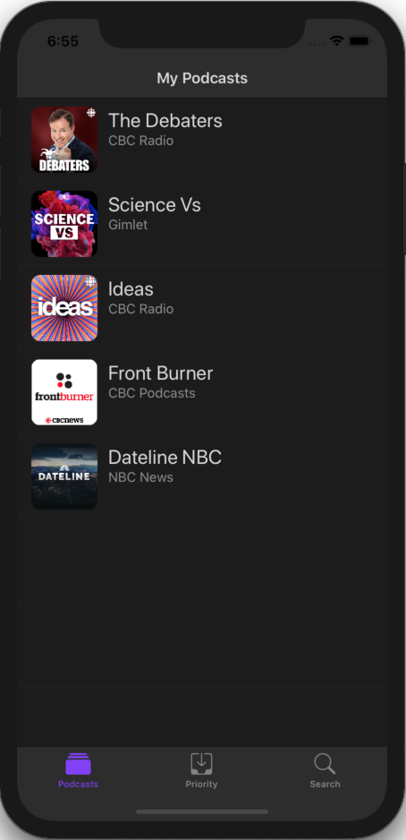

# Podcast App from NSScreenCast

## Attribution: Ben Scheirman

**App Description:**  Podcast player.  Search for, and subscribe to, podcasts.  View a list of top rated podcasts.  View and play podcast episodes.  Persist state - podcast subscriptions, episode play duration.

**Swift Features Used:**
Core Data and Background Context, Operations and Background Queue, Result Type, Diffable Datasource, Cocoapods, Storyboard composition, Notifications, RSS and Atom feeds, JSON Decoding, Image Caching, Gradients and Graphics context, View Model, Time Observer, AVPlayerItem, NSFetchedResultsController, Theming with .appearance, Unit Testing, Overriding main.storyboard on Startup. 

**Attribution Detail:  Full attribution goes to Ben Scheirman for this code, with the exception of the image fetching and caching code (Kingfisher not used) and some minor aspects of the networking stack which are my original code.

**Screenshots:**

